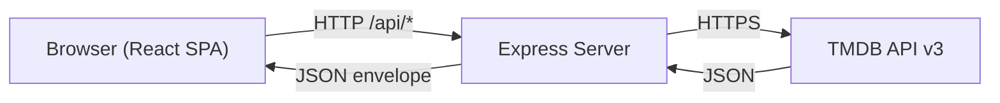

# Architecture Overview

## System Diagram

## How It Works

1. **The user** interacts with the React frontend at `localhost:5173`
2. **The frontend** sends API requests to the Express backend (proxied in dev via Vite)
3. **The backend** forwards requests to the TMDB API with the API key (kept server-side for security)
4. **The backend** wraps TMDB responses in a standardized `{ success, data, error, meta }` envelope
5. **The frontend** renders the data with a premium dark-mode UI

## Technology Stack

| Layer | Technology | Purpose |
|-------|-----------|---------|
| Frontend | React 18 + Vite | SPA with fast HMR |
| Styling | Vanilla CSS + Custom Properties | White-label theming |
| HTTP Client | Axios | API requests with interceptors |
| Backend | Express.js | API proxy server |
| Security | Helmet + CORS + Rate Limiting | Production hardening |
| Logging | Winston | File-based error logging |
| Testing | Vitest + Supertest | Unit and integration tests |
| CI/CD | GitHub Actions → Vercel | Automated deploy |

## Design Principles

- **API key security**: The TMDB API key is never exposed to the frontend
- **White-labeling**: All brand tokens (colors, fonts, titles) are in `client/src/config/`
- **Standardized responses**: Every API response follows the same envelope shape
- **Professional logging**: Winston replaces all `console.log` calls with file-persisted logs
- **Graceful error handling**: Global error handler catches and logs all unhandled errors
